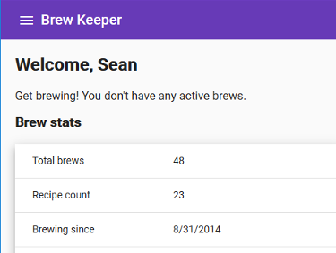

# Brew Keeper
Home brew journal for tracking bottling and refrigeration dates. 

**[Live on Heroku!](http://brewkeeper.herokuapp.com/)**



## Build/Develop
[](https://travis-ci.org/Cynicollision/BrewKeeper)
### Prerequisites
```
npm install -g @angular/cli
npm install -g gulp
npm install -g typescript
```
### Client (Angular)
Install dependencies, run unit and end-to-end tests:
```
cd client
npm install
ng test
ng e2e
```
Then start the development server:
```
ng serve
```
### Server (Node/Express)
Install dependencies, compile TypeScript, run tests:
```
cd server
npm install
tsc
npm test
```
Then start the server:
```
node app
```
Note: Use `tsc -w` while actively developing.
### Packaging
Copy production Angular build output to folder served by the Express app:
```
gulp publish
```
### MongoDB setup
Install MongoDB, then run the following to create the development database and user (credentials must match server/Config.ts):
```
mongod brewkeeper
db.createUser({  
 user:<username>,
 pwd:<password>,
 roles:[  
  {  
     role:"readWrite",
     db:"brewkeeper"
  }
 ],
 mechanisms:[  
  "SCRAM-SHA-1"
 ]
})
```
### Deploy to Heroku
Full build and deploy process. Release branch must have built .js output included.
```
git checkout release
git merge master
gulp publish
cd server
tsc
git commit -m <version>
git push heroku release:master
```
## Dependency Status
Client 

[](https://david-dm.org/Cynicollision/BrewKeeper?path=client)
[](https://david-dm.org/Cynicollision/BrewKeeper?path=client&type=dev)

Server

[](https://david-dm.org/Cynicollision/BrewKeeper)
[](https://david-dm.org/Cynicollision/BrewKeeper?type=dev)
